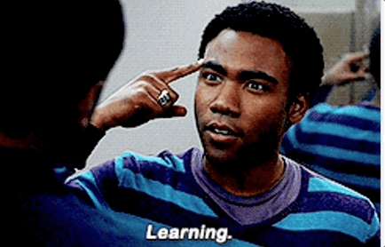

<h1 align="center">
  
  𝐇𝐞𝐥𝐥𝐨
  
</h1>
<h2 align="center">I'm Daniel Rajis, A Computer Science Undergraduate 👨🏾‍💻📈</h2>  
   

## About me🚶🏾‍♂️:

- 🌱 I’m currently studying computer science at the University of Nottingham.
- 🧠 I'm always eager to learn from experienced seniors and professionals.
- 🔭 Presently, I'm engaged in multiple projects, with a particular focus on developing version 2.0 of my existing portfolio website, which 
     holds significant importance for me.

 
  Visitor Count‼️ 
  

## Extra-curricular pursuits🚀:

- 💻 I craft CSS/HTML portfolio websites, offering them to fellow students at no cost and extending the service to external clients for a 
     nominal fee.
- 🏋🏾‍♂️ My fervour for fitness is reflected in creating and editing videos regularly, not only to document my journey but also to inspire     
     others towards healthier lifestyles. 

 

## 💬 Don't hesitate to connect with me:

  - 😅Juggling personal time alongside rigorous computer science studies can be challenging. 
  
 - 🤝Whether it be achieving a balanced university/personal work dynamic, harmonizing work and life commitments, or any related subjects.
 -  I'm always here to offer the best advice I can provide. With a special emphasis on supporting my fellow students!🤝
     
## Do not panic‼️:

  -👨🏾‍💻If you encounter any challenges while testing my code, please don't hesitate to reach out. I'm here to provide assistance and troubleshoot any       testing issues to the best of my ability!

## 🚀 Languages and Tools:

 
 

## 📫 How to reach me: 

- Email me on danielrajis03@gmail.com

